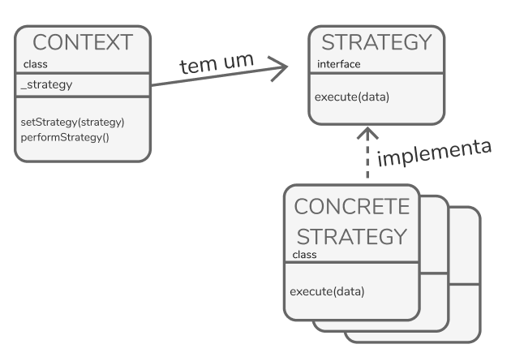

# Strategy

---

## :closed_book: Definição

Tipo de padrão: **comportamental**

> Define uma família de algoritmos, encapsula cada um deles e torna intercambiáveis. A estrátegia permite que o algoritmo varie independentemente dos clientes que a utilizam

---

## :wrench: Funcionamento

O padrão Strategy sugere que você pegue uma classe que faz algo específico em diversas maneiras diferentes e extraia todos esses algoritmos para classes separadas chamadas **estratégias**.

A classe original, chamada **contexto**, deve ter um campo para armazenar uma referência para um dessas estratégias. O contexto delega o trabalho para um objeto estratégia ao invés de executá-lo por conta própria.

O contexto não é responsável por selecionar um algoritmo apropriado para o trabalho. Ao invés disso, o cliente passa a estratégia desejada para o contexto. Ele trabalha com as **estratégias** através de uma interface genérica, que somente expõe um único método para acionar o algoritmo encapsulado dentro da estratégia selecionada.

Desta forma o contexto se torna independente das estratégias concretas, então você pode adicionar novos algoritmos ou modificar os existentes sem modificar o código do contexto ou outras estratégias.

---

## :flashlight: Aplicabilidade

- Usar diferentes variantes de um algoritmo dentro de um objeto e ser capaz de trocar de um algoritmo para outro durante a execução.

- Acabar com a quantidade de classes parecidas que somente diferem na forma que elas executam algum comportamento.

- Extrair o comportamento variante para uma hierarquia de classe separada e combine as classes originais em uma, portando reduzindo código duplicado.

- Isolar a lógica do negócio de uma classe dos detalhes de implementação de algoritmos que podem não ser tão importantes no contexto da lógica.

- Reduzir o numero de operações condicionais muito grande.

---

## :book: Princípios OO utilizados

- #### Encapsule o que varia.

  Pegue a parte do algortimo que varia e encapsule, seja em uma função ou classe por exemplo

- #### Dê prioridade á composição em relação a herança.

  Apesar da herança

- #### Programe para interface, não para implementações.

  Literalmente programa para interfaces (Supertipos), assim o código fica menos preso falicitando o acoplamento livre para mudandanças atravês do uso polimorfismo.
